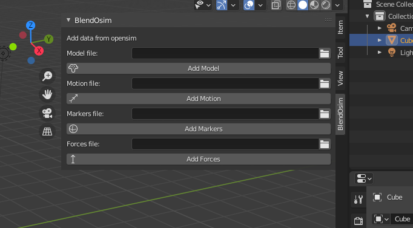
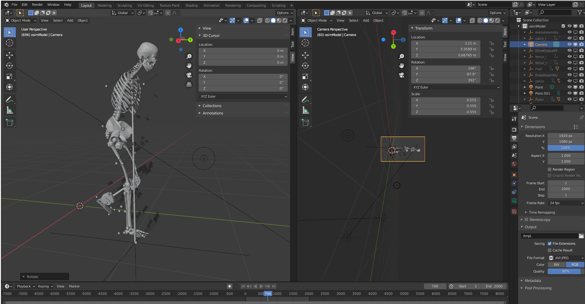

# BlendOsim
An add-on to import Opensim and motion capture data to Blender

## Installation

To install, download the repository into a zip file and install from Blender->Preferences. Make sure that the zip file that you pass to blender has the repository directly in the first level folder (not in a subfolder).

BlendOsim has been tested in blender from version 2.83 up to 3.0. If you need to use a different version and encounter issues please submit an issue. I will do my best to help.

## Getting started

After installing and enabling the add-on, a new tab will appear at your tools panel: **BlendOsim**. 

With this tab you can import:

- **Markers file**: takes a csv file containing the xyz trajectories of the markers in the motion capture recorded in the experiment. This import option inserts mesh spheres, labels, and animates the trajectory location at every keyframe.

- **Forces file**: takes a csv file containing the force, moments and center of pressure for the forceplate data recorded in the experiment.This import option inserts mesh arrows with the tail located at the center of pressure, pointing and scaled in the direction of the force. The location and magnitude of the force is animated at every keyframe provided in the csv file.

- **Model file**: corresponds to the description of the biomechanics model in .osim format. Adding the model will add STL surfaces parented to empty objects that can be later used for animation. 

- **Motion file**: a csv file containing the location and rotation for every segment in the model at each animation keyframe to animate. This option constructs the trajectories for the loaded model file.

Try the files in the example folder!

