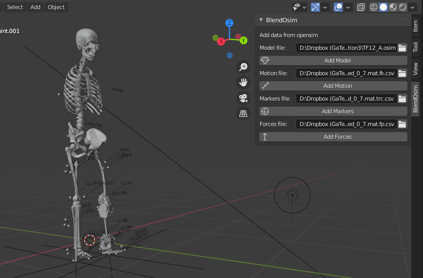

# Summary
`BlendOsim` is an Python add-on for the opensource 3D creation suite `Blender`, This add-on enables improved visualizations for biomechanics research.  `BlendOsim` allows to importing motion capture markers and forceplate data. Furthermore, it enables importing OpenSim models and motion trajectories, offering a richer visualization tool for biomechanics experiments based on motion capture.

With `BlendOsim` the user can surpass the limited visualization from OpenSim by leveraging on the more robust 3D visuals from `Blender` and its advanced rendering features. For example, the user can create renders and multi-camera video sequences that illustrate the experiment, or use the annotate functions to put 3D notes and support the scientific discussion of the biomechanics data.

# Statement of need

Biomechanic analyses of human locomotion require the observation of the trajectories of systems with multiple degrees of freedom. This is achieved by recording the kinematics and external forces of the task with motion capture tools. Motion capture solutions include specialized proprietary software for data adquisition but they are limited to only rudimentary visualization of raw marker data [@Furtado:2019;@Pearson:2017;@s17071591].

The motion capture requires further processing to implement the analysis. For this, OpenSim has achieved recognition in the field for the calculation of bimechanics models and performing motion analysis including inverse kinematics, inverse dynamics and even forward dynamics simulations [@4352056]. However, the visualization tools of the software are still limited, offering low resolution images, no user 3D scope and no simple solution to include background and external objects that exist in the experimental terrain. 

As more complex scenarios are studied in the literature including obstacles and terrains of community ambulation such as stairs and ramps [@Brantley2018;@CHEN2018422;@Li2012], the dissemination of information would benefit from better visualization tools of the locomotion, where the 3D configuration of the human body is presented instead of only 2D plots with joint angle profiles. 

 We released `BlendOsim` as an open-source add-on for the 3D suite `Blender`. `BlendOsim` could enhance the visualization and the disemination of biomechanics in the classroom and publications. With this add-on the user can easily import OpenSim models, motion capture marker data and forceplate data into a full open-source creative suite and 3D environment, and use it to generate scientific illustrations and animations.

# `BlendOsim` add-on

The `BlendOsim` add-on exposes its interface as a tab in the tools panel, containing options to import four data types.

**Markers file**: takes a csv file containing the xyz trajectories of the markers in the motion capture recorded in the experiment. This import option inserts mesh spheres, labels, and animates the trajectory location at every keyframe.

**Forces file**: takes a csv file containing the force, moments and center of pressure for the forceplate data recorded in the experiment.This import option inserts mesh arrows with the tail located at the center of pressure, pointing and scaled in the direction of the force. The location and magnitude of the force is animated at every keyframe provided in the csv file.

**Model file**: corresponds to the description of the biomechanics model in .osim format. Adding the model will add STL surfaces parented to empty objects that can be later used for animation. 

**Motion file**: a csv file containing the location and rotation for every segment in the model at each animation keyframe to animate. This option constructs the trajectories for the loaded model file.

As an example, Figure 1. Shows the exposed user interface and a sample imported model and motion capture data. See more use examples in the gait cycle figures in [@CAMARGO2021110320].

{ width=90%}

# Dependencies

`BlendOsim` is written in Python and works directly with  `Blender` version 2.80 or greater (latest version tested is 2.92). Since Blender does not support the vtp format, the add-on is preloaded with STL surface files for the Simbody model from Opensim. For new models, the user can refer to Paraview [Ahrens2005ParaViewAE] or any CAD software with vtp support to convert the model surfaces to stl. 

# Acknowledgements

We acknowledge the support and funding for Jonathan Camargo by the Fulbright fellowship and Minciencias Colombia.

# References